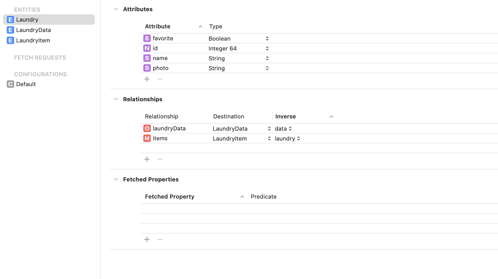
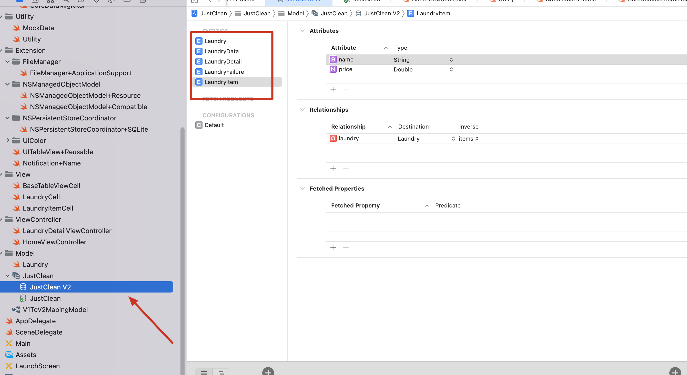
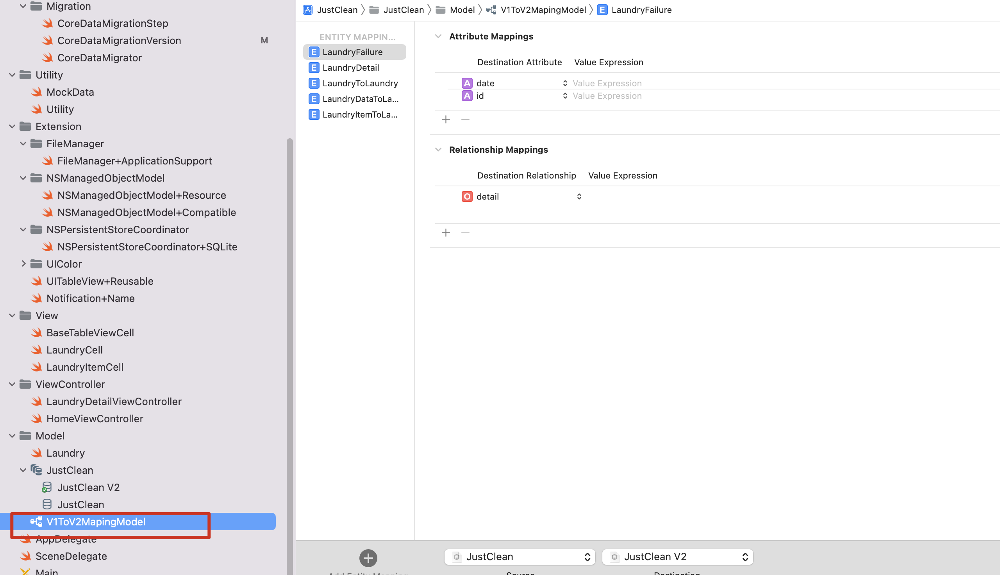

JustClean Demo

Original CoreData API Migration


### Git Structure

OriginV1 means first version before data model restructure.

OriginV2 means second version after data model restructure.

How to Migration from V1 to V2?

1、define data model in 



2、set current model with JustClean

3、define CoreDataMigrationVersion only with JustClean

```swift
enum CoreDataMigrationVersion: String, CaseIterable {
    case version1 = "JustClean"

    // MARK: - Current
    
    static var current: CoreDataMigrationVersion {
        guard let latest = allCases.last else {
            fatalError("no model versions found")
        }
        
        return latest
    }
    
    // MARK: - Migration
    
    func nextVersion() -> CoreDataMigrationVersion? {
        switch self {
        case .version1:
            return nil
        }
    }
}
```


Switch to V2

1、define V2 data model



2、set current model to JustClean V2

3、add a new version

```swift

enum CoreDataMigrationVersion: String, CaseIterable {
    case version1 = "JustClean"
    case version2 = "JustClean V2"
    static var current: CoreDataMigrationVersion {
        guard let latest = allCases.last else {
            fatalError("no model versions found")
        }
        
        return latest
    }
    
    // MARK: - Migration
    
    func nextVersion() -> CoreDataMigrationVersion? {
        switch self {
        case .version1:
            return nil
        case .version2:
            return nil
        }
    }
}
```

4、 add mapping model




##  **Migration Insider**

**1. What is a Step?**

```swift
struct CoreDataMigrationStep {

    let source: NSManagedObjectModel
    let destination: NSManagedObjectModel
    let mapping: NSMappingModel
}
```

A `CoreDataMigrationStep` is a migration between two versions of the model: `source` and `destination` and the actual mapping model itself.

> It's possible to have multiple mapping models between versions, (this can be especially useful when migrating large data sets) in this post in an attempt to keep things simple I assume only one mapping model but if you need to support multiple mappings you would transform the `mapping` property into an array.

**2. How do we group steps?**

First, lets create a representation of what a model version is:

```swift
enum CoreDataVersion: Int {
    case version1 = 1
    case version2

    // MARK: - Accessors

    var name: String {
        if rawValue == 1 {
            return "CoreDataMigration_Example"
        } else {
            return "CoreDataMigration_Example \(rawValue)"
        }
    }

    static var all: [CoreDataVersion] {
        var versions = [CoreDataVersion]()

        for rawVersionValue in 1...1000 { // A bit of a hack here to avoid manual mapping
            if let version = CoreDataVersion(rawValue: rawVersionValue) {
                versions.append(version)
                continue
            }

            break
        }

        return versions.reversed()
    }

    static var latest: CoreDataVersion {
        return all.first!
    }
}
```

`CoreDataVersion` is an enum backed by an `Int` that should mirror the versions available in `*.xcdatamodeld` package. It provides a nice abstraction for what a version is and allows us to ask questions on a type such as:

- "Which is the latest version?"
- "What's the name of that model?"

With both `CoreDataMigrationStep` and `CoreDataVersion` abstraction we can create a migration path from the source model to the destination model:

```swift
class CoreDataMigrationModel {

    let version: CoreDataVersion

    var modelBundle: Bundle {
        return Bundle.main
    }

    var modelDirectoryName: String {
        return "CoreDataMigration_Example.momd"
    }

    static var all: [CoreDataMigrationModel] {
        var migrationModels = [CoreDataMigrationModel]()

        for version in CoreDataVersion.all {
            migrationModels.append(CoreDataMigrationModel(version: version))
        }

        return migrationModels
    }

    static var current: CoreDataMigrationModel {
        return CoreDataMigrationModel(version: CoreDataVersion.latest)
    }

    /**
     Determines the next model version from the current model version.

     NB: the next version migration is not always the next actual version. With
     this solution we can skip "bad/corrupted" versions.
     */
    var successor: CoreDataMigrationModel? {
        switch self.version {
        case .version1:
            return CoreDataMigrationModel(version: .version2)
        case .version2:
            return nil
        }
    }

    // MARK: - Init

    init(version: CoreDataVersion) {
        self.version = version
    }

    // MARK: - Model

    func managedObjectModel() -> NSManagedObjectModel {
        let omoURL = modelBundle.url(forResource: version.name, withExtension: "omo", subdirectory: modelDirectoryName) // optimized model file
        let momURL = modelBundle.url(forResource: version.name, withExtension: "mom", subdirectory: modelDirectoryName)

        guard let url = omoURL ?? momURL else {
            fatalError("unable to find model in bundle")
        }

        guard let model = NSManagedObjectModel(contentsOf: url) else {
            fatalError("unable to load model in bundle")
        }

        return model
    }

    // MARK: - Mapping

    func mappingModelToSuccessor() -> NSMappingModel? {
        guard let nextVersion = successor else {
            return nil
        }

        switch version {
        case .version1: //manual mapped versions
            guard let mapping = customMappingModel(to: nextVersion) else {
                return nil
            }

            return mapping
        default:
            return inferredMappingModel(to: nextVersion)
        }
    }

    func inferredMappingModel(to nextVersion: CoreDataMigrationModel) -> NSMappingModel {
        do {
            let sourceModel = managedObjectModel()
            let destinationModel = nextVersion.managedObjectModel()
            return try NSMappingModel.inferredMappingModel(forSourceModel: sourceModel, destinationModel: destinationModel)
        } catch {
            fatalError("unable to generate inferred mapping model")
        }
    }

    func customMappingModel(to nextVersion: CoreDataMigrationModel) -> NSMappingModel? {
        let sourceModel = managedObjectModel()
        let destinationModel = nextVersion.managedObjectModel()
        guard let mapping = NSMappingModel(from: [modelBundle], forSourceModel: sourceModel, destinationModel: destinationModel) else {
            return nil
        }

        return mapping
    }

    // MARK: - MigrationSteps

    func migrationSteps(to version: CoreDataMigrationModel) -> [CoreDataMigrationStep] {
        guard self.version != version.version else {
            return []
        }

        guard let mapping = mappingModelToSuccessor(), let nextVersion = successor else {
            return []
        }

        let sourceModel = managedObjectModel()
        let destinationModel = nextVersion.managedObjectModel()

        let step = CoreDataMigrationStep(source: sourceModel, destination: destinationModel, mapping: mapping)
        let nextStep = nextVersion.migrationSteps(to: version)

        return [step] + nextStep
    }

    // MARK: - Metadata

    static func migrationModelCompatibleWithStoreMetadata(_ metadata: [String : Any]) -> CoreDataMigrationModel? {
        let compatibleMigrationModel = CoreDataMigrationModel.all.first {
            $0.managedObjectModel().isConfiguration(withName: nil, compatibleWithStoreMetadata: metadata)
        }

        return compatibleMigrationModel
    }
}
```

`CoreDataMigrationModel` this is where the real magic happens.

```swift
func migrationSteps(to version: CoreDataMigrationModel) -> [CoreDataMigrationStep] {
    guard self.version != version.version else {
        return []
    }

    guard let mapping = mappingModelToSuccessor(), let nextVersion = successor else {
        return []
    }

    let sourceModel = managedObjectModel()
    let destinationModel = nextVersion.managedObjectModel()

    let step = CoreDataMigrationStep(source: sourceModel, destination: destinationModel, mapping: mapping)
    let nextStep = nextVersion.migrationSteps(to: version)

    return [step] + nextStep
}
```

The above method recursively builds an array containing all the steps required to perform a migration from the current version (as defined by the `version` property) to the latest version.

For each of these steps, the model determines if the mapping should be inferred or needs to explicitly defined by the developer:

```swift
func mappingModelToSuccessor() -> NSMappingModel? {
    guard let nextVersion = successor else {
        return nil
    }

    switch version {
    case .version1: //custom mapped versions
        guard let mapping = customMappingModel(to: nextVersion) else {
            return nil
        }

        return mapping
    default:
        return inferredMappingModel(to: nextVersion)
    }
}
```

> While strictly speaking we didn't need to include the inferred branch for migrating form `version1` to `version2` (and normally I try to avoid using `default`), we will need an inferred mapping branch for future migrations so I've included it here for completeness.

As you can see we determine whether to create a custom or inferred mapping model by using a `switch` statement to check which version is current being accessed. You will know if you need to custom a mapping model if you break the rules as defined in the [Lightweight documentation](https://developer.apple.com/library/content/documentation/Cocoa/Conceptual/CoreDataVersioning/Articles/vmLightweightMigration.html) or more likely by attempting to perform an inferred migration and having the app crash on you during development.

```swift
func inferredMappingModel(to nextVersion: CoreDataMigrationModel) -> NSMappingModel {
    do {
        let sourceModel = managedObjectModel()
        let destinationModel = nextVersion.managedObjectModel()
        return try NSMappingModel.inferredMappingModel(forSourceModel: sourceModel, destinationModel: destinationModel)
    } catch {
        fatalError("unable to generate inferred mapping model")
    }
}

func customMappingModel(to nextVersion: CoreDataMigrationModel) -> NSMappingModel? {
    let sourceModel = managedObjectModel()
    let destinationModel = nextVersion.managedObjectModel()
    guard let mapping = NSMappingModel(from: [modelBundle], forSourceModel: sourceModel, destinationModel: destinationModel) else {
        return nil
    }

    return mapping
}
```

With `inferredMappingModel` we ask `NSMappingModel` to produce the mapping model by *figuring* out the differences and how to map between them. Again we follow the *fail fast* approach by catching the exception and then throwing a more meaningful fatal error.

`customMappingModel` is very similar but instead of getting an `NSMappingModel` instance based on Core Data figuring out the mapping, we ask it to search the app bundle and find a `*.xcmappingmodel` which has a matching `source` and `destination` model.

The next important part of `CoreDataMigrationModel` is to look at how the `successor` version of the current model is determined.

```swift
var successor: CoreDataMigrationModel? {
    switch self.version {
    case .version1:
        return CoreDataMigrationModel(version: .version2)
    case .version2:
        return nil
    }
}
```

As we only have two models we only need to handle migrating from `version1` to `version2`. `version2` being the current model, doesn't require a mapping model. You may be thinking that this is overkill and we could simplify this by always getting the next version up as the successor but sadly real-life isn't always so perfect and it's possible that we released a model version that contains issues and want to skip migrating any unaffected users to that version. With the above approach it would be possible to define a custom path. So if we pretend that we actually have four versions, it would be possible to skip a version altogether (in this case `version3`) which would give us the following structure:

```swift
var successor: CoreDataMigrationModel? {
    switch self.version {
    case .version1:
        return CoreDataMigrationModel(version: .version2)
    case .version2:
        return CoreDataMigrationModel(version: .version4) //skipping version3
    case .version3:
        return CoreDataMigrationModel(version: .version4)
    case .version4:
        return nil
    }
}
```

In order to perform we need to create an initial `CoreDataMigrationModel` instance based on the currently installed model version:

```swift
class CoreDataMigrationSourceModel: CoreDataMigrationModel {

    // MARK: - Init

    init?(storeURL: URL) {
        guard let metadata = NSPersistentStoreCoordinator.metadata(at: storeURL) else {
            return nil
        }

        let migrationVersionModel = CoreDataMigrationModel.all.first {
            $0.managedObjectModel().isConfiguration(withName: nil, compatibleWithStoreMetadata: metadata)
        }

        guard migrationVersionModel != nil else {
            return nil
        }

        super.init(version: migrationVersionModel!.version)
    }
}
```

`CoreDataMigrationSourceModel` is a convenience subclass of `CoreDataMigrationModel`. We will see later how this is used.

**3. What's responsible for triggering the migration?**

Ok, so we've looked at the how the steps are created and how each step knows which mapping model will move it to it's successor, below we are going to look at how those steps are called and how we prepare the app for a migration to occur.

```swift
class CoreDataMigrator {

    // MARK: - Check

    func requiresMigration(at storeURL: URL, currentMigrationModel: CoreDataMigrationModel = CoreDataMigrationModel.current) -> Bool {
        guard let metadata = NSPersistentStoreCoordinator.metadata(at: storeURL) else {
            return false
        }

        return !currentMigrationModel.managedObjectModel().isConfiguration(withName: nil, compatibleWithStoreMetadata: metadata)
    }

    // MARK: - Migration

    func migrateStore(at storeURL: URL) {
        migrateStore(from: storeURL, to: storeURL, targetVersion: CoreDataMigrationModel.current)
    }

    func migrateStore(from sourceURL: URL, to targetURL: URL, targetVersion: CoreDataMigrationModel) {
        guard let sourceMigrationModel = CoreDataMigrationSourceModel(storeURL: sourceURL as URL) else {
            fatalError("unknown store version at URL \(sourceURL)")
        }

        forceWALCheckpointingForStore(at: sourceURL)

        var currentURL = sourceURL
        let migrationSteps = sourceMigrationModel.migrationSteps(to: targetVersion)

        for step in migrationSteps {
            let manager = NSMigrationManager(sourceModel: step.source, destinationModel: step.destination)
            let destinationURL = URL(fileURLWithPath: NSTemporaryDirectory(), isDirectory: true).appendingPathComponent(UUID().uuidString)

            do {
                try manager.migrateStore(from: currentURL, sourceType: NSSQLiteStoreType, options: nil, with: step.mapping, toDestinationURL: destinationURL, destinationType: NSSQLiteStoreType, destinationOptions: nil)
            } catch let error {
                fatalError("failed attempting to migrate from \(step.source) to \(step.destination), error: \(error)")
            }

            if currentURL != sourceURL {
                //Destroy intermediate step's store
                NSPersistentStoreCoordinator.destroyStore(at: currentURL)
            }

            currentURL = destinationURL
        }

        NSPersistentStoreCoordinator.replaceStore(at: targetURL, withStoreAt: currentURL)

        if (currentURL != sourceURL) {
            NSPersistentStoreCoordinator.destroyStore(at: currentURL)
        }
    }

    // MARK: - WAL

    func forceWALCheckpointingForStore(at storeURL: URL) {
        guard let metadata = NSPersistentStoreCoordinator.metadata(at: storeURL), let migrationModel = CoreDataMigrationModel.migrationModelCompatibleWithStoreMetadata(metadata)  else {
            return
        }

        do {
            let model = migrationModel.managedObjectModel()
            let persistentStoreCoordinator = NSPersistentStoreCoordinator(managedObjectModel: model)

            let options = [NSSQLitePragmasOption: ["journal_mode": "DELETE"]]
            let store = persistentStoreCoordinator.addPersistentStore(at: storeURL, options: options)
            try persistentStoreCoordinator.remove(store)
        } catch let error {
            fatalError("failed to force WAL checkpointing, error: \(error)")
        }
    }
}
```

`CoreDataMigrator` is undertaking **3** tasks:

1. Determining if migration is necessary
2. Setting up a consistent state
3. Performing the migration

```swift
func requiresMigration(at storeURL: URL, currentMigrationModel: CoreDataMigrationModel = CoreDataMigrationModel.current) -> Bool {
    guard let metadata = NSPersistentStoreCoordinator.metadata(at: storeURL) else {
        return false
    }

    return !currentMigrationModel.managedObjectModel().isConfiguration(withName: nil, compatibleWithStoreMetadata: metadata)
}
```

In the above method, we are loading the meta data for the persistent store that is currently on the device and determining if it is compatible with latest version's meta data - returning either `true` or `false` based on the outcome of that comparison.

```swift
func forceWALCheckpointingForStore(at storeURL: URL) {
    guard let metadata = NSPersistentStoreCoordinator.metadata(at: storeURL), let migrationModel = CoreDataMigrationModel.migrationModelCompatibleWithStoreMetadata(metadata)  else {
        return
    }

    do {
        let model = migrationModel.managedObjectModel()
        let persistentStoreCoordinator = NSPersistentStoreCoordinator(managedObjectModel: model)

        let options = [NSSQLitePragmasOption: ["journal_mode": "DELETE"]]
        let store = persistentStoreCoordinator.addPersistentStore(at: storeURL, options: options)
        try persistentStoreCoordinator.remove(store)
    } catch let error {
        fatalError("failed to force WAL checkpointing, error: \(error)")
    }
}
```

Since iOS 7 Core Data has used Write-Ahead Logging (WAL) journalling by default on it's SQLite database. In WAL mode Core Data appends transactions to a `-wal` file and uses a `-shm` shared memory file, both in the same location as the main `sqlite` file. While this results in improved performance I noticed when testing that sometimes during migrations, the changes contained in the `-wal` file were not migrated. This would then result in a crash when anything in the new model format was then written to the old model formatted `-wal` file. The above method is forcing the changes contained in the `-wal` file to be committed to the main `sqlite` file.

> Please note that in order for the `-wal` commit to be successful, it is necessary to load the model of the sqlite file on disk rather than the latest model.

As we will see below this forced committing of the WAL transactions will happen just before we perform the migration.

```swift
func migrateStore(at storeURL: URL) {
    migrateStore(from: storeURL, to: storeURL, targetVersion: CoreDataMigrationModel.current)
}

func migrateStore(from sourceURL: URL, to targetURL: URL, targetVersion: CoreDataMigrationModel) {
    guard let sourceMigrationModel = CoreDataMigrationSourceModel(storeURL: sourceURL as URL) else {
        fatalError("unknown store version at URL \(sourceURL)")
    }

    forceWALCheckpointingForStore(at: sourceURL)

    var currentURL = sourceURL
    let migrationSteps = sourceMigrationModel.migrationSteps(to: targetVersion)

    for step in migrationSteps {
        let manager = NSMigrationManager(sourceModel: step.source, destinationModel: step.destination)
        let destinationURL = URL(fileURLWithPath: NSTemporaryDirectory(), isDirectory: true).appendingPathComponent(UUID().uuidString)

        do {
            try manager.migrateStore(from: currentURL, sourceType: NSSQLiteStoreType, options: nil, with: step.mapping, toDestinationURL: destinationURL, destinationType: NSSQLiteStoreType, destinationOptions: nil)
        } catch let error {
            fatalError("failed attempting to migrate from \(step.source) to \(step.destination), error: \(error)")
        }

        if currentURL != sourceURL {
            //Destroy intermediate step's store
            NSPersistentStoreCoordinator.destroyStore(at: currentURL)
        }

        currentURL = destinationURL
    }

    NSPersistentStoreCoordinator.replaceStore(at: targetURL, withStoreAt: currentURL)

    if (currentURL != sourceURL) {
        NSPersistentStoreCoordinator.destroyStore(at: currentURL)
    }
}
```

In the above method we iterate through each of the migration steps using an instance of `NSMigrationManager`.

The more alert among you will have noticed that we store the user's data into a temporary `sqlite` file rather than override the starting `sqlite` file. This is a safety precaution incase an error happens during migration. We only overwrite the starting `sqlite` file once we know that the migration has been a success - this can be extremely useful during development.

In the above class we've seen a number of methods used that are not part of the standard `NSPersistentStoreCoordinator` API so I've included the extension that contains these methods below. As with most extensions, the methods are used to reduce boilerplate code.

```swift
extension NSPersistentStoreCoordinator {

    // MARK: - Destroy

    static func destroyStore(at storeURL: URL) {
        do {
            let persistentStoreCoordinator = NSPersistentStoreCoordinator(managedObjectModel: NSManagedObjectModel())
            try persistentStoreCoordinator.destroyPersistentStore(at: storeURL, ofType: NSSQLiteStoreType, options: nil)
        } catch let error {
            fatalError("failed to destroy persistent store at \(storeURL), error: \(error)")
        }
    }

    // MARK: - Replace

    static func replaceStore(at targetURL: URL, withStoreAt sourceURL: URL) {
        do {
            let persistentStoreCoordinator = NSPersistentStoreCoordinator(managedObjectModel: NSManagedObjectModel())
            try persistentStoreCoordinator.replacePersistentStore(at: targetURL, destinationOptions: nil, withPersistentStoreFrom: sourceURL, sourceOptions: nil, ofType: NSSQLiteStoreType)
        } catch let error {
            fatalError("failed to replace persistent store at \(targetURL) with \(sourceURL), error: \(error)")
        }
    }

    // MARK: - Meta

    static func metadata(at storeURL: URL) -> [String : Any]?  {
        return try? NSPersistentStoreCoordinator.metadataForPersistentStore(ofType: NSSQLiteStoreType, at: storeURL, options: nil)
    }

    // MARK: - Add

    func addPersistentStore(at storeURL: URL, options: [AnyHashable : Any]) -> NSPersistentStore {
        do {
            return try addPersistentStore(ofType: NSSQLiteStoreType, configurationName: nil, at: storeURL, options: options)
        } catch let error {
            fatalError("failed to add persistent store to coordinator, error: \(error)")
        }

    }
}
```

*I won't go into their purpose as I think that is self-evident.*

###### WRAPPING IT ALL INTO THE MANAGER

At the start of this post we looked at our simple, migration free Core Data stack, it's now time to go back to that manager and look at how supporting migrations will affect it.

```swift
class CoreDataManager {

    let migrator: CoreDataMigrator

    lazy var persistentContainer: NSPersistentContainer! = {
        let persistentContainer = NSPersistentContainer(name: "CoreDataMigration_Example")
        let description = persistentContainer.persistentStoreDescriptions.first
        description?.shouldInferMappingModelAutomatically = false //inferred mapping will be handled else where

        return persistentContainer
    }()

    lazy var backgroundContext: NSManagedObjectContext = {
        let context = self.persistentContainer.newBackgroundContext()
        context.mergePolicy = NSMergeByPropertyObjectTrumpMergePolicy

        return context
    }()

    lazy var mainContext: NSManagedObjectContext = {
        let context = self.persistentContainer.viewContext
        context.automaticallyMergesChangesFromParent = true

        return context
    }()

    // MARK: - Singleton

    static let shared = CoreDataManager()

    // MARK: - Init

    init(migrator: CoreDataMigrator = CoreDataMigrator()) {
        self.migrator = migrator
    }

    // MARK: - SetUp

    func setup(completion: @escaping () -> Void) {
        loadPersistentStore {
            completion()
        }
    }

    // MARK: - Loading

    private func loadPersistentStore(completion: @escaping () -> Void) {
        migrateStoreIfNeeded {
            self.persistentContainer.loadPersistentStores { description, error in
                guard error == nil else {
                    fatalError("was unable to load store \(error!)")
                }

                completion()
            }
        }
    }

    private func migrateStoreIfNeeded(completion: @escaping () -> Void) {
        guard let storeURL = persistentContainer.persistentStoreDescriptions.first?.url else {
            fatalError("persistentContainer was not set up properly")
        }

        if migrator.requiresMigration(at: storeURL) {
            DispatchQueue.global(qos: .userInitiated).async {
                self.migrator.migrateStore(at: storeURL)

                DispatchQueue.main.async {
                    completion()
                }
            }
        } else {
            completion()
        }
    }
}
```

As you can see, it's not too different to what we seen before. But let's look at what has changed:

```swift
let migrator: CoreDataMigrator
```

We store an instance `CoreDataMigrator` as a property which we pass in during init'ing the `CoreDataManager` instance:

```swift
init(migrator: CoreDataMigrator = CoreDataMigrator()) {
    self.migrator = migrator
}
```

As we will see in our unit testing by injecting the migrator we will be able to more easily test different scenarios by overriding it's methods.

As we are going to override the default migration process we next need to take control of it:

```swift
lazy var persistentContainer: NSPersistentContainer! = {
    let persistentContainer = NSPersistentContainer(name: "CoreDataMigration_Example")
    let description = persistentContainer.persistentStoreDescriptions.first
    description?.shouldInferMappingModelAutomatically = false //inferred mapping will be handled else where

    return persistentContainer
}()
```

Here is set `shouldInferMappingModelAutomatically` to false as our `CoreDataMigrationModel` class will handle setting the correct mapping model approach on each `CoreDataMigrationStep` step.

```swift
private func loadPersistentStore(completion: @escaping () -> Void) {
    migrateStoreIfNeeded {
        self.persistentContainer.loadPersistentStores { description, error in
            guard error == nil else {
                fatalError("was unable to load store \(error!)")
            }

            completion()
        }
    }
}

private func migrateStoreIfNeeded(completion: @escaping () -> Void) {
    guard let storeURL = persistentContainer.persistentStoreDescriptions.first?.url else {
        fatalError("persistentContainer was not set up properly")
    }

    if migrator.requiresMigration(at: storeURL) {
        DispatchQueue.global(qos: .userInitiated).async {
            self.migrator.migrateStore(at: storeURL)

            DispatchQueue.main.async {
                completion()
            }
        }
    } else {
        completion()
    }
}
```

4、UI features.

All the features metions in documents has been implemented in the project, please follow the comments.

